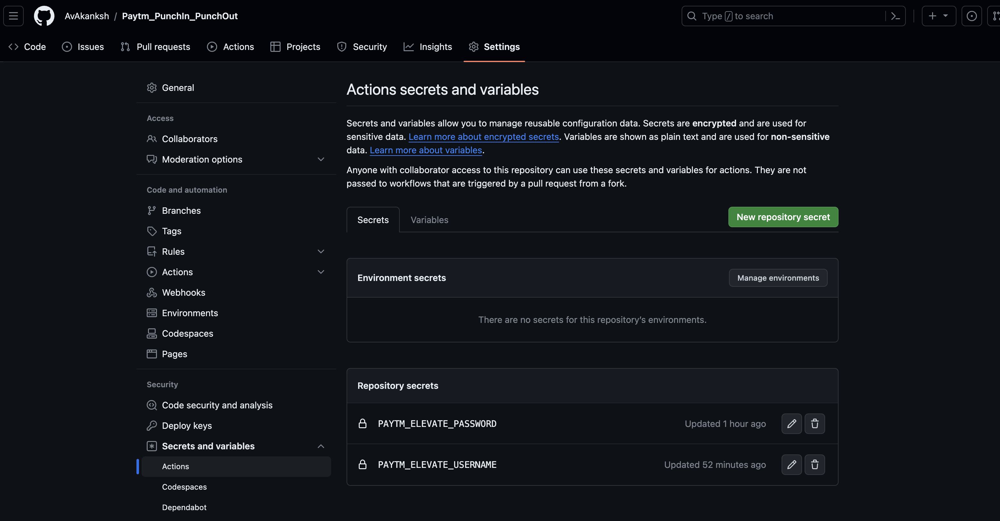

# Paytm_PunchIn_PunchOut

This Repo sole purpose is to punch in and punch out so that i never again have to worry about attendance regularization

If any Paytm Employee wants to make use of this repository then you only have to do these two steps:
 - Clone the Repository 
 - Create 2 secret keys in secret section of this repo
   - **PAYTM_ELEVATE_USERNAME** (put your username in this)
   - **PAYTM_ELEVATE_PASSWORD** (put your password in this)

take help of the below screenshot 





# Note:
> Currently the github action is only configured to run on weekdays that is Mon - Fri at 9:30 am and 6:30 pm so you will get punched in at 9:30 and will be punched out at 6:30 pm.


## Then how to run it when you are working on Holidays/Weekends ?
- You can use the app on your phone or desktop to do the Punch In/Out (**the boring way!!!!**)
- Or you can run the workflow manually on the github repo (i know it is a bit long 😅)
- Or if you want to use github-cli (gh) 

  - It is a one time thing to do
    ```shell
    brew install gh
    gh auth login
    ```
    Complete the Authentication part

  - Then just clone the repo to your local and go into the directory and then run the below command
    ```shell
    gh workflow run 
    ```
    Select the github workflow and you are done
    

